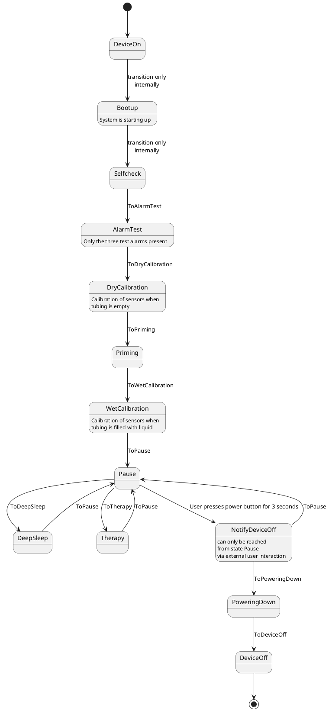

# HMI - Gateway - Communication protocol

This document contains the specifics of the communication between HMI and Gatemay of the enECMO system.

## Basics

The basic idea is that the Gateway always sends the current state and the current measurement
The HMI communicates with the Gateway over a RS485 interface. This interface provides originally a bus infrastructure where a multitude of participants can communicate with each other. As only one participant can send data on the same time, a more or less sophisticated communication scheme has to be employed. In our case with two participants this boils down to a half-duplex serial connection. Thus, we employ a communication scheme where each participant only sends a fixed number of messages before listening for the reply. We use Ascii coding for transmitting the data meaning e.g. numbers are coded by their textual representation instead of a numerical bitwise representation. 

## Message format

Each message is composed out of the following parts:

* Start sign (Start of Heading - 0x01)
* Length of text (in Ascii numbers (e.g. 32) as 5 digit number
* Comma sign (0x2C)
* CRC over Payload (in ASCII numbers) as 10 digit number
* Payload start sign (Start of Text - 0x02)
* Payload (see below)
* End sign (End of Text - 0x03)

Each payload is constructed like this:

* Data structure identifier (single character, always printable, e.g. 'h')
* Opening bracket '{'
* Comma separated values, either actual values or further data structures
* Closing bracket '}'

Example payload:

> x{23,56,y{8}}

## Message sequence

A communication sequence is always threefold:

1. The Gateway sends a message containing all current states and measurements of the system (user interaction message).
2. The HMI sends a message, either containing the whole system state it wishes to change or sub parts (see below).
3. The Gateway responds with a communication status message containing information if the last message by the HMI was complete or if it was not able to process it properly.

As mentioned before only one participant is in send mode while the other is in receiving mode. If the sender completes its message sending process it switches to receiving mode. 
The receiving part switches to sending mode if it receives a complete message. It have to wait for xxx milliseconds to allow the respective other to switch to receiving mode. 
Otherwise, it waits for xxx millisesonds. If no or only an incomplete message was received it switches to sending mode, too.
Messages accepted by the system are [System state](index.md#system-state), [State machine](index.md#state-machine), [Motor Setpoint](index.md#motor-setpoint), [Gas Setpoint](index.md#gas-setpoint), [Measurements](index.md#measurements), [Alarm system](index.md#alarm-system), [Therapy Sensors](index.md#therapy-sensors) and [Engine Sensors](index.md#engine-sensors).

## CRC

The CRC is calculated as CRC32 with polnynomal 0x04C11DB7.

## Messages

In the following the current set of messages is defined. Each message conforms to the format described above.

### Containers

Basically the information carried by the messages are organised hierarchically. Messages usually contain sub-messages which by themselves can contain sub-messages as well. There is no principal limit for the maximum hierarchy level. The lowest part of this hierarchy is always a data field. The information in this field can either be a scalar value (e.g. '3.1415' or 'C'), or it is a container. This container can either be a *vector* or a *range* which are described in the following.

#### Range

Ranges comprise valid value ranges for a value. Thus it is comprised out of five elements which can have context dependent meanings:

| Message part  | Description                                          | Message originate in sytem | Message orginates in HMI                         |
|---------------|------------------------------------------------------|----------------------------|--------------------------------------------------|
| Signature     | '^'                                                  |                            |                                                  |
| Min           | Minimal technical possible value given by the system | Minimal value possible     | ignored (should be 0 to save transmission space) |
| Lower Border  | Lower limit determined by the HMI                    | Current lower alarm limit  | new lower alarm limit given by the user          |
| Value         | Value of this field                                  | Measured / set value       | calibration request                              |
| Higher Border | Higher limit determined by the HMI                   | Current higher alarm limit | new higher alarm limit given by the user         |
| Max           | Maximal technical possible value given by the system | Maximal value possible     | ignored (should be 0 to save transmission space) |

It is important to note that the delimiter of the elements of ranges is a '<' instead of a comma. This delimiter shall remind the user that Min, Lower Border, Higher border and Max are constrained to the condition Min <= Lower Border <= Higher Border <= Max.

Example:

    ^{-100<-50<0<50<100}

When in one of the calibration states the range is used to set the alarm limits for the respective parameter. To accomplish this the lower border and the higher border entries have to be set either to the new alarm limit or to the maximum value of the value range (most of the time intmax).

When commanding the system to do a zeroing calibration the value entry is used to start a calibration process. To accomplish this value has to be set to a value which is not zero.

#### Vector

A vector comprises multiples (can also be of size zero) elements of the same message type.

| Message part | Description                      |
|--------------|----------------------------------|
| Signature    | '#'                              |
| Size         | Number of elements in the vector |
| 1st element  | First message                    |
| ...          | ...                              |
| Nth element  | Nth message                      |

Example for empty vector:

    #{0}

Example for vector with two elements:

    #{2,x{1,2,3},x{2,3,4}}

## HMI Acknowledgement

The Gateway always sends this message after it received a message from the HMI or the reception timeout exceeded. If the last transaction was correct in the sense that the communication itself was successful (start symbol received, CRC correct and length correct), and the message was among the expected messages, the system acknowledges the communication. Otherwise an error code is given if the transaction itself was jeopardized. If the message is just not among the expected ones the reply marks the last message as "not-acknowledged".

| Message part | Description                                  |
|--------------|----------------------------------------------|
| Signature    | 'k'                                          |
| State        | 'A' for achnoweledged,                       |
|              | 'N' for *not* acknowledged.                  |
|              | 'S' for no start symbol received.            |
|              | 'T' for no valid transmission size received. |
|              | 'C' for wrong CRC.                           |
|              | 'U' for unknown (this should never happen).  |

### System State 

This message (aka. User Interaction) is sent regularly to the HMI. It contains information about the current state of the system.

| Message part  | Type                                      | Description                                          |
|---------------|-------------------------------------------|------------------------------------------------------|
| Signature     | Single character                          | 'I'                                                  |
| State machine | [State machine](index.md#state-machine)   | Current configuration of the state machine           |
| Motor         | [Motor Setpoint](index.md#motor-setpoint) | State of the motor set point                         |
| Blender       | [Gas Setpoint](index.md#gas-setpoint)     | State of the gas set point if the blender is present |
| Measurements  | [Measurements](index.md#measurements)     | All measurements of the system                       |
| Alarm system  | [Alarm system](index.md#alarm-system)     | State of the alarm system                            |

### State machine

This message transports the current state and the wished for transistion to the next state.

  | Message part | Type             | Description                |
  |--------------|------------------|----------------------------|
  | Signature    | Single character | 's'                        |
  | State        | Single character | Active state:              |
  |              |                  | 'o' for DEVICE OFF         |
  |              |                  | 'O' for DEVICE ON          |
  |              |                  | 'b' for BOOTUP             |
  |              |                  | 's' for SELFCHECK          |
  |              |                  | 'c' for DRY CALIBRATION    |
  |              |                  | 'p' for PRIMING            |
  |              |                  | 'd' for DEEP SLEEP         |
  |              |                  | 'z' for PAUSE              |
  |              |                  | 'P' for PERFUSION          |
  |              |                  | 'n' for NOTIFY DEVICE OFF  |
  |              |                  | 'D' for POWERING DOWN      |
  |              |                  | 'a' for ALARM TEST         |
  |              |                  | 'f' for WET CALIBRATION    |
  | Transition   | Single character | Wished for transition:     |
  |              |                  | 'o' for TO DEVICE OFF      |
  |              |                  | 'O' for TO DEVICE ON       |
  |              |                  | 'b' for TO BOOTUP          |
  |              |                  | 's' for TO SELFCHECK       |
  |              |                  | 'c' for TO DRY CALIBRATION |
  |              |                  | 'z' for TO PAUSE           |
  |              |                  | 'p' for TO PRIMING         |
  |              |                  | 'd' for TO DEEP SLEEP      |
  |              |                  | 'P' for TO PERFUSION       |
  |              |                  | 'a' for TO ALARM TEST      |
  |              |                  | 'D' for TO POWERING DOWN   |
  |              |                  | 'f' for TO WET CALIBRATION |

Example:

    s{z,p}

The system implements the following state machine:

Until reaching the state Pause in which the HMI presents the home screen all transitions only lead in one direction. 

If the HMI wants to change the state of the system it has to send this message with the state currently active and the transition it wants to got to. It is important to include the current state as otherwise the system does not accept this transition.

### Motor Setpoint

This message contains the mode settings of the motor.

| Message part | Type                                | Description                                              |
|--------------|-------------------------------------|----------------------------------------------------------|
| Signature    | Single character                    | 'M'                                                      |
| Control mode | Single character                    | 'l' for FPM mode, 'r' for RPM mode                       |
| RPM wish     | [Range with uint32](index.md#range) | Wished for value for motor speed in rotations per minute |
| FPM wish     | [Range with uint32](index.md#range) | Wished for value for pump speed in liters per minute     |

The borders set in the ranges control the value range in which the PID controller can operate. 

### Gas Setpoint

This message contains the settings of the gas blender.

| Message part           | Type                                | Description                                              |
|------------------------|-------------------------------------|----------------------------------------------------------|
| Signature              | Single character                    | 'G'                                                      |
| Flow wish              | [Range with uint32](index.md#range) | Wished for value for gas flow in 10^-1 liters per minute |
| Oxygen percentage wish | [Range with uint32](index.md#range) | Wished for value for oxygen percentage in percent        |

### Measurements 

This message contains all the measurements of the system. It is subdivided in many different messages reflecting the locations in the system.

| Message part    | Type                                        | Description                                                                       |
|-----------------|---------------------------------------------|-----------------------------------------------------------------------------------|
| Signature       | Single character                            | 'm'                                                                               |
| Engine sensors  | [Engine sensors](index.md#engine-sensors)   | All sensors regarding motor and pump                                              |
| Therapy sensors | [Therapy sensors](index.md#therapy-sensors) | All sensors in context of blood and gas                                           |
| System sensors  | [System sensors](index.md#system-sensors)   | All sensors measuring data regarding the system itself                            |
| System health   | [System health](index.md#system-health)     | List of the working condition of several subsystem necessary for using the system |

### Engine Sensors 

This message contains the values of the motor sensors.

| Message part         | Type                               | Description                                                                                                                        |
|----------------------|------------------------------------|------------------------------------------------------------------------------------------------------------------------------------|
| Signature            | Single character                   | 'e'                                                                                                                                |
| Fault Flags          | uint32                             | Internal fault flags. Please ignore at HMI site                                                                                    |
| Motor Status         | uint16                             | Internal motor status. Please ignore at HMI site                                                                                   |
| Current RPM          | [Range with int32](index.md#range) | Measured motor / pump speed in rotations per minute incl. current alarm borders                                                    |
| RPM Deviation        | [Range with int32](index.md#range) | Difference between wished for motor speed value and measured value in rotations per minute incl. current alarm borders             |
| Flow Deviation       | [Range with int32](index.md#range) | Difference between wished for blood flow value and measured blood flow value in milliliters per minute incl. current alarm borders |
| Regulation Completed | bool                               | True (i.e. value not zero) if the regulation process of the PID controller is finished                                             |
| Bus Voltage          | uint16                             | Voltage measured at motor controller in mV                                                                                         |
| Motor Power          | uint16                             | Current power consumption at motor controller in W                                                                                 |
| Temperature MOSFETs  | uint16                             | Temperature at converters in °C/10                                                                                                 |
| Temperature Motor    | uint16                             | Temperature at motor coilt in °C/10                                                                                                |
| Temperature Pump     | uint16                             | Temperature at pump casing in °C/10                                                                                                |
| Temperature MCU      | uint16                             | Temperature at motor controller MCU in °C/10                                                                                       |
| RunTime Total        | uint32                             | Internal runtime value. Please ignore at HMI                                                                                       |
| RunTime Actual       | uint32                             | Internal runtime value. Please ignore at HMI                                                                                       |
| RunTime Session      | uint32                             | Internal runtime value. Please ignore at HMI                                                                                       |

Sending this message is used to set the alarm limits of current RPM, RPM deviation and flow deviation.

### Therapy Sensors 

This message contains all values of the therapy sensors (e.g. blood pressure and blood flow)

| Message part | Type                                      | Description |
|--------------|-------------------------------------------|-------------|
| Signature    | Single character                          | 't'         |
| Blood        | [Blood pipeline](index.md#blood-pipeline) | 't'         |
| Gas          | [Gas pipeline](index.md#gas-pipeline)     | 't'         |

### Blood pipeline

This message comprises all measurements which are connected to the blood transported through the system.

| Message part | Type                                                                          | Description                                                                                        |
|--------------|-------------------------------------------------------------------------------|----------------------------------------------------------------------------------------------------|
| Signature    | Single character                                                              | 'b'                                                                                                |
| PRE PUMP     | [Invasive blood sensor bundle](index.md#invasive-blood-sensor-bundle)         | Measurement before pump also known as PT1                                                          |
| AMONG PUMP   | [Invasive blood sensor bundle](index.md#invasive-blood-sensor-bundle)         | Measurement between pump and oxygenator also known as PT2                                          |
| POST OXY     | [Invasive blood sensor bundle](index.md#invasive-blood-sensor-bundle)         | Measurement after oxygenator also known as PT3                                                     |
| DELTA PUMP   | [Invasive blood sensor bundle](index.md#invasive-blood-sensor-bundle)         | Delta over ogygenator - not measured only calculated                                               |
| OUTSIDE TUBE | [Non-invasive blood sensor bundle](index.md#non-invasive-blood-sensor-bundle) | Main flow measurement with Sonoflow sensor at the main blood pipe                                  |
| AT FILTER    | [Non-invasive blood sensor bundle](index.md#non-invasive-blood-sensor-bundle) | Optional flow measurement with second Sonoflow at potential filter position                        |
| PRE SYSTEM   | [Blood chemistry](index.md#blood-chemistry)                                   | Measurements of blood chemistry. Currently only a placeholder as Datamed sensor is not present yet |

### Non-Invasive blood sensor bundle

This message comprises measurements of a sensor which sits outside the blood tube and has no direct contact with the blood stream (thus non-invasive).

| Message part | Type                                | Description                                                                      |
|--------------|-------------------------------------|----------------------------------------------------------------------------------|
| Signature    | Single character                    | 'B'                                                                              |
| Flow rate    | [Range with int32](index.md#range)  | Flow rate incl. alarm limits in milliliter per minute                            |
| Bubble size  | [Range with uint16](index.md#range) | Last largest detected bubble size incl. alarm limits in percent of tube diameter |

### Invasive blood sensor bundle

This message comprises measurements of a sensor which sits inside the blood tube and has direct contact with the blood stream (thus invasive).

| Message part | Type                               | Description                                            |
|--------------|------------------------------------|--------------------------------------------------------|
| Signature    | Single character                   | 'v'                                                    |
| Temperature  | int32                              | Temperature (currently not measured so it is always 0) |
| Pressure     | [Range with int32](index.md#range) | Pressure incl. alarm borders in mmHg                   |

### Blood chemistry

| Message part | Type             | Description                                                        |
|--------------|------------------|--------------------------------------------------------------------|
| Signature    | Single character | 'c'                                                                |
| Placeholder  | int32            | There is no chemistry measurement at the moment, so please ignore. |

### Gas pipeline

This message comprises all measurements which are connected to the gas part of the oxygenator.

| Message part      | Type                                | Description                                                                                                       |
|-------------------|-------------------------------------|-------------------------------------------------------------------------------------------------------------------|
| Signature         | Single character                    | 'g'                                                                                                               |
| Connected device  | Single character                    | Gas device connected to the system. Can either be 'n' for no device, 'b' for gas blender or 's' for sweep gas box |
| Oxygen percentage | [Range with uint32](index.md#range) | Oxygen percentage of the gas flowing into the oxygenator in percent.                                              |
| CO2 Output        | [Range with uint32](index.md#range) | CO2 percentage of the gas flowing out of the oxygenator in percent.                                               |
| Gas flow          | [Range with int32](index.md#range)  | Gas flow through the oxygenator in 10^-1 liter per minute                                                         |
| Temperature       | int32                               | Temperature                                                                                                       |
| Pressure A        | uint32                              | For future use. Please ignore.                                                                                    |
| Pressure B        | uint32                              | For future use. Please ignore.                                                                                    |
| Pressure C        | uint32                              | For future use. Please ignore.                                                                                    |

### System Sensors 

This message contains the values of the system internal sensors.

| Message part         | Type                                    | Description                                                                                                                                                  |
|----------------------|-----------------------------------------|--------------------------------------------------------------------------------------------------------------------------------------------------------------|
| Signature            | Single character                        | 'S'                                                                                                                                                          |
| System Batteries     | [Battery array](index.md#battery-array) | Battery data                                                                                                                                                 |
| Standby Voltage 3.3V | uint32                                | Voltage in mV                                                                                                                                                |
| Supply Voltage 3.3V  | uint32                                | Voltage in mV                                                                                                                                                |
| Supply Voltage 5.0V  | uint32                                | Voltage in mV                                                                                                                                                |
| Supply Voltage 24.0V | uint32                                | Voltage in mV                                                                                                                                                |
| Supply Current 24.0V | uint32                                | Current in mA                                                                                                                                                |
| Mobile InputVoltage  | uint32                                | Voltage in mV                                                                                                                                                |
| Mobile InputCurrent  | uint32                                | Current in mA                                                                                                                                                |
| Pump Voltage         | uint32                                | Voltage in mV                                                                                                                                                |
| HMI Voltage          | uint32                                | Voltage in mV                                                                                                                                                |
| System Voltage       | uint32                                | Voltage in mV                                                                                                                                                |
| Shutdown State       | Single character                        | State of the power module. 'i' for idle, 'b' for shutdown init, 's' for waiting for first package, 'r' waiting for second package. Used internally by system |

### Battery Array

This message contains the data of all batteries.

| Message part | Type                        | Description    |
|--------------|-----------------------------|----------------|
| Signature    | Single character            | 'a'            |
| Battery 1    | [Battery](index.md#battery) | First Battery  |
| Battery 2    | [Battery](index.md#battery) | Second Battery |
| Battery 3    | [Battery](index.md#battery) | Third Battery  |

### Battery 

This message contains the data of a single battery.

| Message part       | Type             | Description               |
|--------------------|------------------|---------------------------|
| Signature          | Single character | 'r'                       |
| voltage            | uint32           | Battery voltage in mV     |
| Current            | int32            | Battery current in mA     |
| Current Averaged   | int32            | Averaged current in mA    |
| Voltage ADC mC     | uint32           | Alternative voltage in mA |
| Current ADC mC     | int32            | Alternative current in mA |
| Temperature        | uint32           | Temperature in 10^-1 °C   |
| Remaining Capacity | uint32           | Remaining capacity in mAh |

### System Health 

This message contains the values of the motor sensors.

| Message part               | Type             | Description                                                        |
|----------------------------|------------------|--------------------------------------------------------------------|
| Signature                  | Single character | 'h'                                                                |
| Pressure Sensor Pre Pump   | Single character | 'u' if health state is unknown, 'o' if it's ok, 'd' if it's defect |
| Pressure Sensor Among Pump | Single character | 'u' if health state is unknown, 'o' if it's ok, 'd' if it's defect |
| Pressure Sensor Post Oxy   | Single character | 'u' if health state is unknown, 'o' if it's ok, 'd' if it's defect |
| Motor Controller           | Single character | 'u' if health state is unknown, 'o' if it's ok, 'd' if it's defect |
| Motor                      | Single character | 'u' if health state is unknown, 'o' if it's ok, 'd' if it's defect |
| Flow Sensor Outside Tube   | Single character | 'u' if health state is unknown, 'o' if it's ok, 'd' if it's defect |
| Flow Sensor At Filter      | Single character | 'u' if health state is unknown, 'o' if it's ok, 'd' if it's defect |
| CO2 Sensor                 | Single character | 'u' if health state is unknown, 'o' if it's ok, 'd' if it's defect |
| O2 Sensor                  | Single character | 'u' if health state is unknown, 'o' if it's ok, 'd' if it's defect |
| Power Module               | Single character | 'u' if health state is unknown, 'o' if it's ok, 'd' if it's defect |

### Alarm System

The alarm system message represents the state of the alarm management system. This message is also used to control the alarm system as HMI.

| Message part        | Type                                 | Description                                              |
|---------------------|--------------------------------------|----------------------------------------------------------|
| Signature           | Single character                     | 'y'                                                      |
| Remaining Mute Time | uint32                               | Time the system turns off audible alarms in milliseconds |
| Active alarms       | [Vector with Alarm](index.md#vector) | List of currently active alarms                          |

If the HMI wants to mute the active alarms it has to construct a alarm system message with an arbitrary remaining mute time greater than zero. The vector for active alarms may be empty in this case. Here is an example message:

> y{10,#{0}}

If the HMI wants to acknowledge one or more alarms it has to construct a alarm system message with an active alarms vector containing all alarms it wants to acknowledge. Each of these alarms needs the RESPONSE field to be set to 'A' for acknowledge. Thus, a sample message would look like this one:

> y{0,#{2,A{0,222,0,A},A{0,223,0,A}}}

The alarms in the active alarms vector are sorted first by alarm class (i.e. high before medium before low before informative) and then by a priority defined at the project wide alarm list.

### Alarm

The alarm message represents a single alarm.

| Message part   | Type             | Description                                    |
|----------------|------------------|------------------------------------------------|
| Signature      | Single character | 'A'                                            |
| Count          | uint32           | Internal value. Please ignore.                 |
| ALARMCONTENT   | uint16           | Alarm number                                   |
| offendingValue | uint64           | Value which caused this alarm, if applicable   |
| RESPONSE       | Single character | 'N' for not acknowledged, 'A' for acknowledged |

ALARMCONTENT denotes the number of the alarm which is unique throughout the project and defined in MatrixALM. Offending value is only important for range/parametric alarms and denotes the (last) value which caused the alarm to appear.

